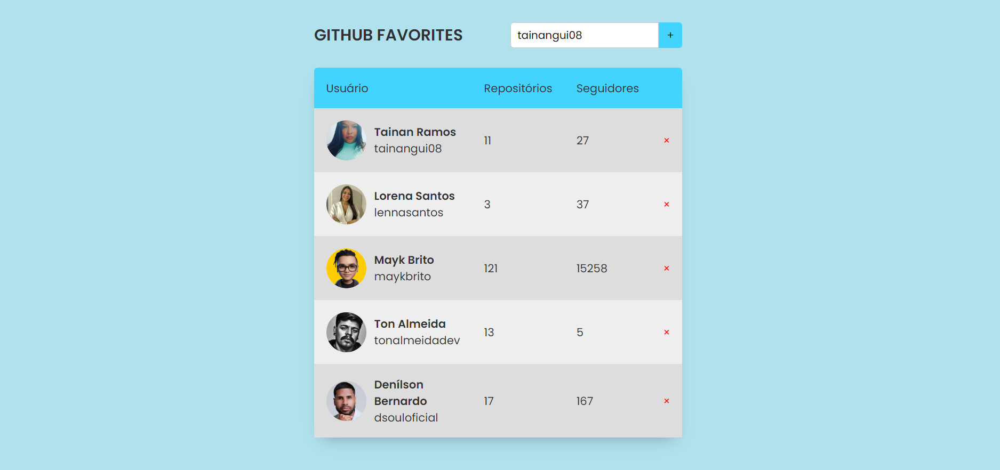

# Sobre

Git Favorites, projeto que consiste em trazer dados de usuários do Github utilizando a sua API(Application Programming Interface), para adicionar os usuários favoritos em uma tabela com informações como:

Imagem de usuário, nome de usuário, quantidade de repositórios, seguidores.

Tópicos abordados:
- Eventos JavaScript
- Assincronismo
- Promises, async e await
- Programação orientada a objetos.
- Classes, herança e polimorfismo.
- Imutabilidade
- try, catch e throw
- localStorage
- API Github

## Preview

